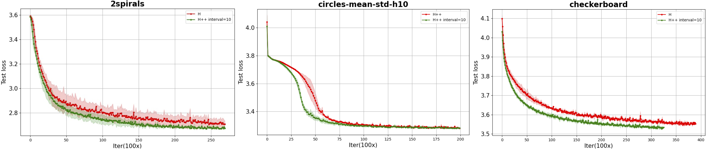
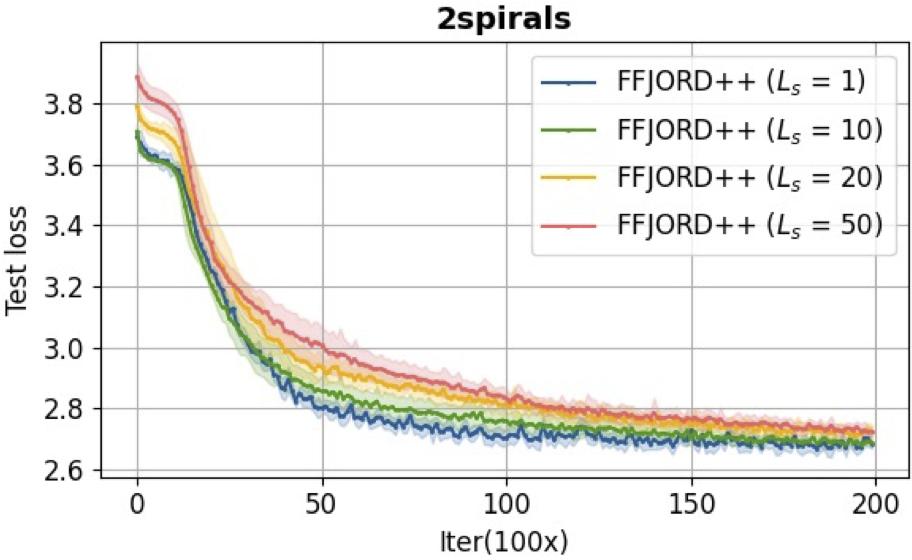

# FFJORD++ (Simulations experiments in our paper)

We validated **FFJORD++** on several toy distributions.

<a name="environment dependencies"></a>
## Environment Dependencies

FFJORD++ is built on [FFJORD](https://arxiv.org/abs/1810.01367), please refer to the [Prerequisites](https://github.com/rtqichen/ffjord?tab=readme-ov-file#prerequisites) in **FFJORD**.

## Usage

We provide the script for density estimation on different datasets.

```
python train_toy.py --data 8gaussians --divergence_fn "hutchplusplus" --q_interval 10 --save experiment
```
where ```--datasets``` selected from `['swissroll', '8gaussians', 'pinwheel', 'circles', 'moons', '2spirals', 'checkerboard', 'rings']`


We visualize the **density estimation comparison** during training process on `checkerboard` and `2spirals`.


Apply differnet divergence functions for FFJORD:
- ```divergence_fn = "bf"``` denotes brute force algorithms via computing the $\text{Tr}(\frac{\delta f}{\delta z(t)})$ directly.
- ```divergence_fn = "approximate"``` denotes Hutchinson trace estimator using stochastic vectors to approximate the unbiased estimation $\mathbb{E}_{p(\mathbf{v})}[\mathbf{v}^\top \text{Tr}(\frac{\delta f}{\delta z(t)}) \mathbf{v}]$.
- ```divergence_fn = "hutchplusplus"``` denotes Hutch++ trace estimator involveing a low-rank approximation to reduce variance in generative modeling.

We evaluate FFJORD++ with **negative log-likelihood** of density estimation during trianing process. 




- Set ```q_interval = 10``` to accelerate training process while remaining density modeling quality.
- Set ```--x_scale``` and ```--y_scale``` to build datasets with various scales for training.

