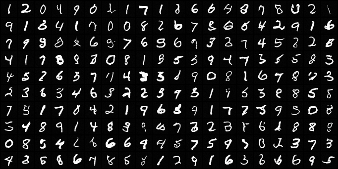
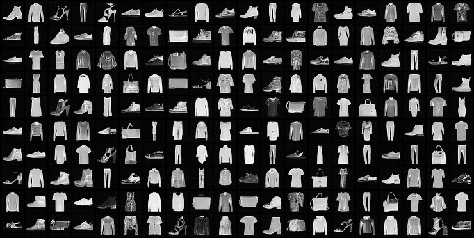
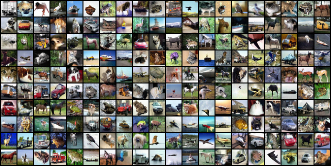

# SB-FBSDE++ (Image data modeling experiments in our paper)

We apply Hutch++ to advanced SB-based diffusion models and compare their performance in image data modeling.


<a name="environment dependencies"></a>
## Environment Dependencies

SB-FBSDE++ is built on [SB-FBSDE](https://arxiv.org/abs/2110.11291), please refer to the [Prerequisites](https://github.com/ghliu/SB-FBSDE#installation) in **SB-FBSDE**.

## Training

We provide the script for image data modeling on different datasets.

```bash
python main.py \
  --problem-name <PROBLEM_NAME> \
  --divergence_fn "hutchplusplus" \
  --forward-net <FORWARD_NET> \
  --backward-net <BACKWARD_NET> \
  --num-FID-sample <NUM_FID_SAMPLE> \ # add this flag only for CIFAR-10
  --dir <DIR> \
  --log-tb 
```
To train an SB-FBSDE++ from scratch, run the above command, where 
- ```--problem-name``` is the dataset. We support `MNIST`, `Fasion-MNIST` and `CIFAR10`.
- `FORWARD_NET` & `BACKWARD_NET` are the deep networks for forward and backward drifts. We support `Unet` and `nscnpp`.
- `NUM_FID_SAMPLE` is the number of generated images used to evaluate FID locally. We recommend 10000 for training CIFAR-10. Note that this requires first downloading the [FID statistics checkpoint](https://github.com/ghliu/SB-FBSDE#evaluating-the-cifar-10-checkpoint). 
- `DIR` specifies where the results (e.g. snapshots during training) shall be stored.

Additionally, use `--load <LOAD>` to restore previous checkpoint or pre-trained model.
For training CIFAR-10 specifically, we support loading the pre-trained [NCSN++](https://drive.google.com/drive/folders/1sP4GwvrYiI-sDPTp7sKYzsxJLGVamVMZ) as the backward policy of the first SB training stage (this is because the first SB training stage can degenerate to denoising score matching under proper initialization; see more details in [Appendix D of SB-FBSDE](https://openreview.net/pdf?id=nioAdKCEdXB)).

## Evaluation

Please refer the [Evaluating the CIFAR-10 Checkpoint](https://github.com/ghliu/SB-FBSDE#evaluating-the-cifar-10-checkpoint) in **SB-FBSDE**

## Examples

We provide images generated by SB-FBSDE++ for the `MNIST`, `Fasion-MNIST` and `CIFAR10`.






